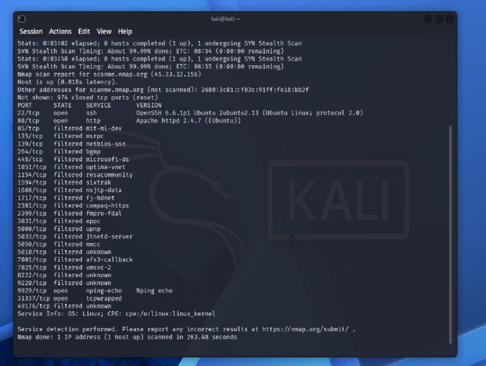

# Escaneo básico con Nmap sobre un objetivo autorizado

## 1. Objetivo y autorización

**Target:** `scanme.nmap.org` (45.33.32.156)

Este host es mantenido públicamente por el propio Nmap Project como objetivo autorizado para practicar la herramienta. La autorización está documentada oficialmente en el manual de Nmap:

> "For testing purposes, you have permission to scan the host scanme.nmap.org. This permission only includes scanning via Nmap and not testing exploits or denial of service attacks. To conserve bandwidth, please do not initiate more than a dozen scans against that host per day."
>
> — [Nmap Reference Guide, Examples](https://nmap.org/book/man-examples.html)

Se optó por este target en lugar de un programa de bug bounty en Bugcrowd porque, al revisar varios programas activos (Auth0/Okta, FIS, codefortynine), todos prohibían explícitamente el uso de herramientas de escaneo automatizado o lo condicionaban a reglas ambiguas (rate limits, exclusión de hallazgos, riesgo de ban). `scanme.nmap.org` ofrece autorización explícita, pública y sin ambigüedad, cumpliendo el requisito de legalidad del enunciado.

## 2. Comando ejecutado

```bash
nmap -sV scanme.nmap.org
```

- `-sV`: detección de servicio y versión en los puertos abiertos.

## 3. Captura de terminal

Comando ejecutado y resultado completo obtenido en Kali Linux:



## 4. Resultados obtenidos

**Duración del escaneo:** 263.48 segundos
**Sistema operativo detectado:** Linux (`cpe:/o:linux:linux_kernel`)

| Puerto | Estado | Servicio | Versión |
|---|---|---|---|
| 22/tcp | open | ssh | OpenSSH 6.6.1p1 Ubuntu 2ubuntu2.13 (protocol 2.0) |
| 80/tcp | open | http | Apache httpd 2.4.7 ((Ubuntu)) |
| 9929/tcp | open | nping-echo | Nping echo |
| 31337/tcp | open | tcpwrapped | — |
| 85, 135, 139, 264, 445, 1051, 1154, 1594, 1688, 1717, 2381, 2399, 3031, 5000, 5033, 5050, 5810, 7001, 7025, 8222, 9220, 49176/tcp | filtered | varios | — |
| 974 puertos | closed | — | — |

