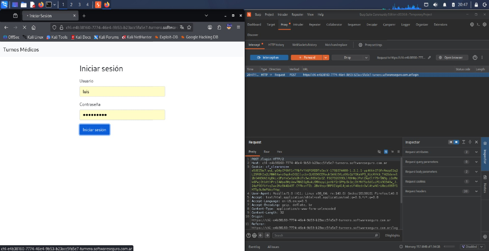
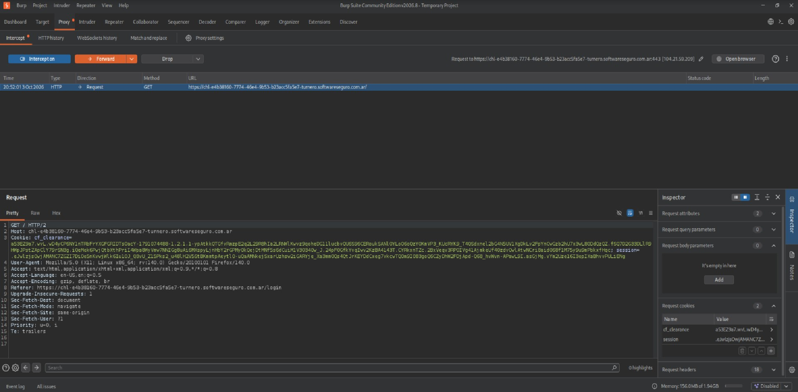
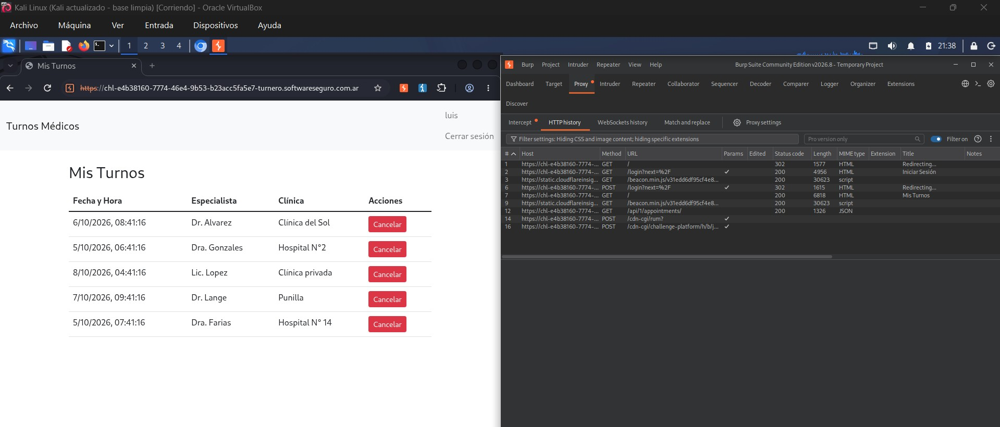

# Intercepción de peticiones con Burp Suite — Turnos Médicos

## Objetivo

Interceptar una petición de uno de los laboratorios de Software Seguro, detenerla en vuelo antes de que llegue al servidor y documentar los endpoints encontrados, sus métodos y qué hace cada uno.

## Entorno

- **Herramienta:** Burp Suite Community Edition v2026.8
- **Sistema:** Kali Linux (VirtualBox)
- **Aplicación:** Turnos Médicos (laboratorio de Software Seguro)
- **Proxy:** `127.0.0.1:8080`, con el navegador configurado para pasar por Burp

## Petición interceptada y detenida en vuelo

Con **Intercept on** activado en `Proxy → Intercept`, completé el formulario de login con el usuario `luis` y presioné **Iniciar sesión**. Burp retuvo la petición `POST /login` en su cola: el navegador quedó cargando y la petición **no llegó al servidor** mientras estuvo detenida. Desde ese punto se puede modificar, descartar (**Drop**) o dejar seguir (**Forward**).

En la captura se observa que:

- La petición es `POST /login` sobre HTTP/2.
- Usa `Content-Type: application/x-www-form-urlencoded` y envía **2 parámetros** en el body (usuario y contraseña).
- Solo lleva 1 cookie (`cf_clearance`, de Cloudflare): todavía **no hay sesión** de la aplicación.

## Resultado al hacer Forward

Al presionar **Forward**, la petición llegó al servidor y el login fue exitoso. El servidor respondió con un redirect (302) y el navegador realizó automáticamente un `GET /`. Esa nueva petición también fue retenida por Burp:

Ahora la petición lleva **2 cookies**: `cf_clearance` y `session`. La cookie `session` no estaba en el POST, por lo que fue emitida por el servidor como respuesta al login. Esto confirma que el `POST /login` es el que crea la sesión.

Al hacer Forward nuevamente, la página cargó y se mostraron los turnos del usuario `luis`:

## Endpoints de la aplicación

| # | Método | Endpoint | Respuesta | Qué hace |
|---|--------|----------|-----------|----------|
| 1 | GET | `/` | 302 (sin sesión) / 200 (con sesión) | Es la página principal. Sin sesión redirige a `/login?next=%2F`; con sesión muestra "Mis Turnos". |
| 2 | GET | `/login?next=%2F` | 200 (HTML) | Muestra el formulario de inicio de sesión. El parámetro `next` indica a qué ruta volver después de autenticarse. |
| 3 | POST | `/login?next=%2F` | 302 | Recibe usuario y contraseña (form-urlencoded), valida las credenciales, crea la sesión (cookie `session`) y redirige a la ruta indicada en `next`. |
| 4 | GET | `/api/1/appointments/` | 200 (JSON) | Devuelve los turnos médicos del usuario logueado (fecha y hora, especialista y clínica). La página los renderiza en la tabla "Mis Turnos". |

### Detalle del flujo

1. `GET /` → el servidor detecta que no hay sesión y responde 302 hacia el login.
2. `GET /login?next=%2F` → se muestra el formulario.
3. `POST /login?next=%2F` → se envían las credenciales; el servidor responde 302 y emite la cookie `session`.
4. `GET /` → ya con sesión, devuelve la página "Mis Turnos".
5. `GET /api/1/appointments/` → la página consulta la API y obtiene los turnos en JSON.

## Endpoints de infraestructura (Cloudflare)

Estas peticiones aparecen en el historial pero **no pertenecen a la lógica de la aplicación**: las genera Cloudflare, que protege el sitio.

| Método | Endpoint | Función |
|--------|----------|---------|
| GET | `static.cloudflareinsights.com/beacon.min.js` | Script de analítica y métricas de Cloudflare. |
| POST | `/cdn-cgi/rum?` | Envío de telemetría de rendimiento del navegador (Real User Monitoring). |
| POST | `/cdn-cgi/challenge-platform/...` | Verificación anti-bot de Cloudflare (relacionada con la cookie `cf_clearance`). |

## Observaciones

- Las credenciales viajan en el body de un `POST`, y no en la URL, lo cual evita que queden registradas en historiales o logs de acceso.
- La sesión se maneja con la cookie `session`, emitida por el servidor tras el `POST /login`.
- El endpoint `/api/1/appointments/` no recibe ningún identificador de usuario: el servidor determina de quién son los turnos a partir de la cookie de sesión.
- La API está versionada en la ruta (`/api/1/`).

## Conclusión

Con Burp Suite como proxy de intercepción fue posible detener la petición `POST /login` antes de que llegara al servidor, inspeccionar sus cabeceras y su body, y luego dejarla continuar para observar cómo se crea la sesión y cómo la aplicación obtiene los turnos del usuario mediante `GET /api/1/appointments/`.
