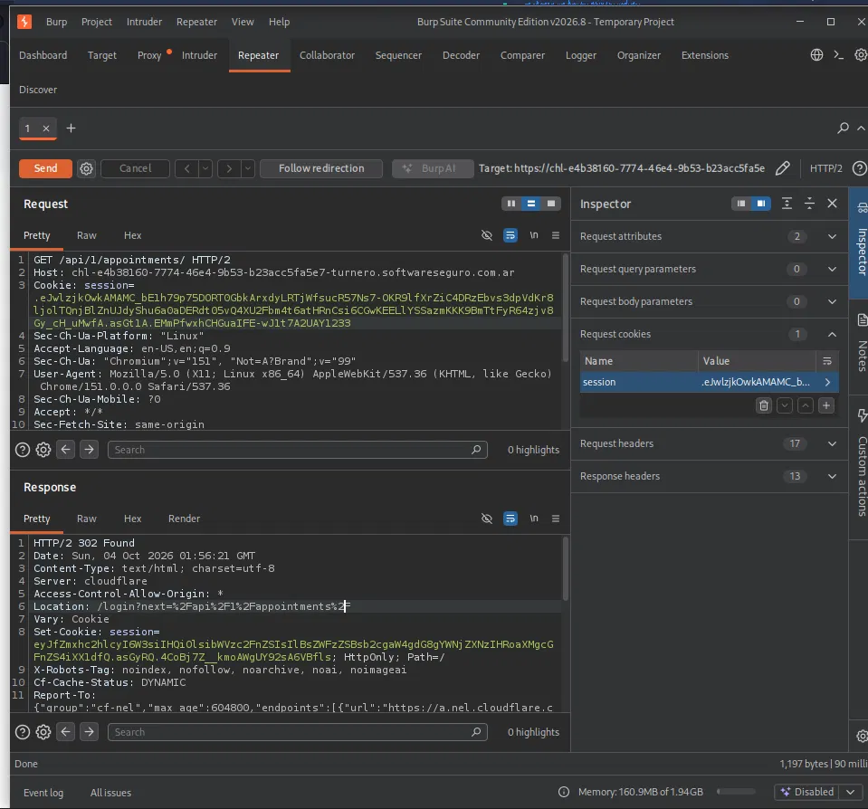
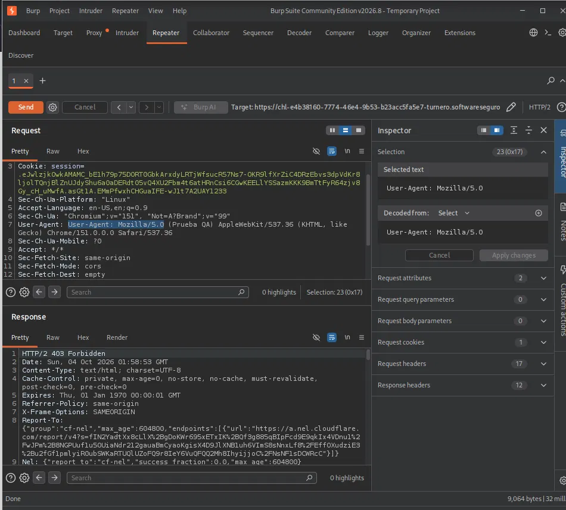

# Objetivo 2: Manipulación manual de peticiones (Repeater) — Turnos Médicos

## Objetivo

Tomar una petición interceptada en el Objetivo 1, enviarla al módulo Repeater de Burp Suite, modificar manualmente un parámetro y observar la respuesta del servidor.

## Entorno

- **Herramienta:** Burp Suite Community Edition v2026.8
- **Aplicación:** Turnos Médicos (laboratorio de Software Seguro)
- **Petición base:** `GET /api/1/appointments/` (enviada a Repeater con "Send to Repeater" desde HTTP history)

## Prueba A — Alterar la cookie `session`

Se tomó la petición `GET /api/1/appointments/` con una sesión válida y se modificó manualmente el valor de la cookie `session`, agregando el sufijo `1233` al final del token.



**Request modificado:**
```
GET /api/1/appointments/ HTTP/2
Host: chl-e4b38160-7774-46e4-9b53-b23acc5fa5e7-turnero.softwareseguro.com.ar
Cookie: session=<token original>...1233
```

**Respuesta del servidor:**
```
HTTP/2 302 Found
Location: /login?next=%2Fapi%2F1%2Fappointments%2F
Set-Cookie: session=<nuevo token vacío/reseteado>; HttpOnly; Path=/
```

**Análisis:** el servidor detectó que el token de sesión ya no era válido (probablemente está firmado, y alterar un carácter invalida la firma) y respondió con un redirect al login en lugar de devolver los turnos. Además reseteó la cookie `session` en la respuesta. Esto indica que la aplicación valida correctamente la integridad de la sesión y no es posible acceder a los datos manipulando el valor de la cookie "a ciegas".

## Prueba B — Modificar el User-Agent

Sobre la misma petición (con la cookie `session` original, válida), se modificó el header `User-Agent`, cambiándolo a:

```
User-Agent: Mozilla/5.0 (Prueba QA) AppleWebKit/537.36 (KHTML, like Gecko) Chrome/151.0.0.0 Safari/537.36
```



**Respuesta del servidor:**
```
HTTP/2 403 Forbidden
Cache-Control: private, max-age=0, no-store, no-cache, must-revalidate
X-Frame-Options: SAMEORIGIN
Report-To: {"group":"cf-nel", ...}
Nel: {"report_to":"cf-nel", ...}
```

**Análisis:** a diferencia de la Prueba A, este bloqueo no parece provenir de la lógica de la aplicación sino de **Cloudflare**, que se interpone delante del servidor (se observan las cabeceras `cf-nel` y `Report-To`, características de Cloudflare). El User-Agent modificado no respeta el formato típico de un navegador real, y el WAF lo identificó como sospechoso, devolviendo 403 antes de que la petición llegara a la aplicación.

## Conclusiones

- El Repeater permite reenviar y editar libremente una petición ya capturada, sin pasar de nuevo por el flujo normal del navegador, lo cual es clave para probar manualmente el manejo de sesión, parámetros y headers.
- **Cookie `session` alterada →** la aplicación responde correctamente invalidando el acceso (302 a login), lo que sugiere un buen manejo de integridad de sesión.
- **User-Agent alterado →** el bloqueo (403) parece originarse en Cloudflare (WAF), no en la aplicación en sí, lo que indica una capa adicional de protección delante del servidor.
- Ambas pruebas muestran que modificar manualmente una petición en el Repeater es una forma efectiva de validar los controles de seguridad de una aplicación sin necesidad de repetir todo el flujo desde el navegador.
